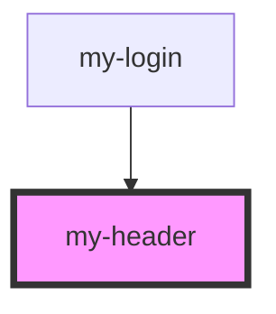

# my-header

<!-- Auto Generated Below -->

## Dependencies

### Used by

 - [my-login](../my-login)

### Graph

----------------------------------------------

*Built with [StencilJS](https://stenciljs.com/)*
